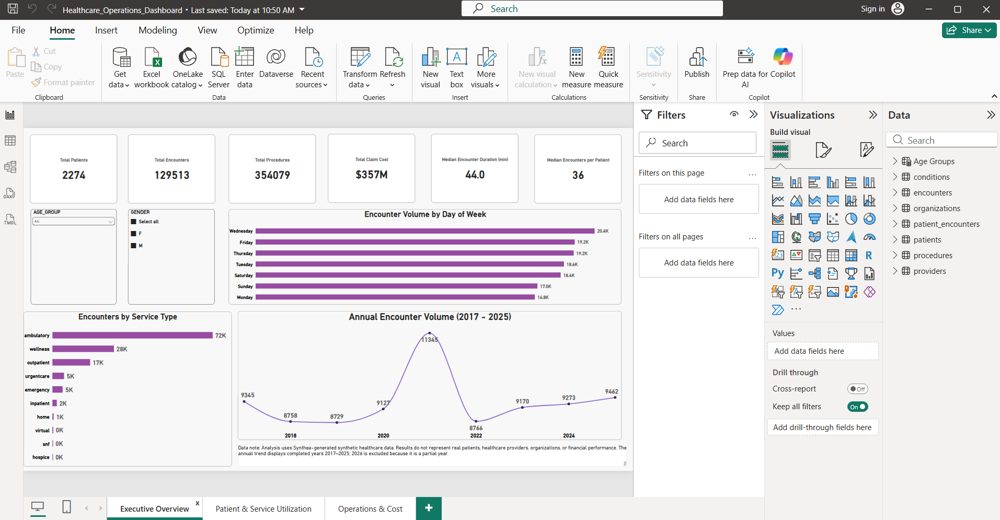
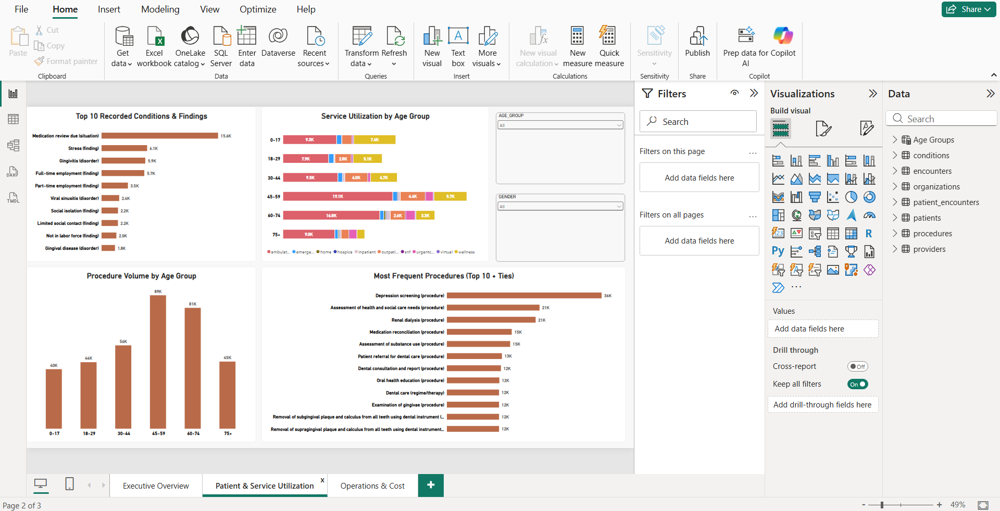
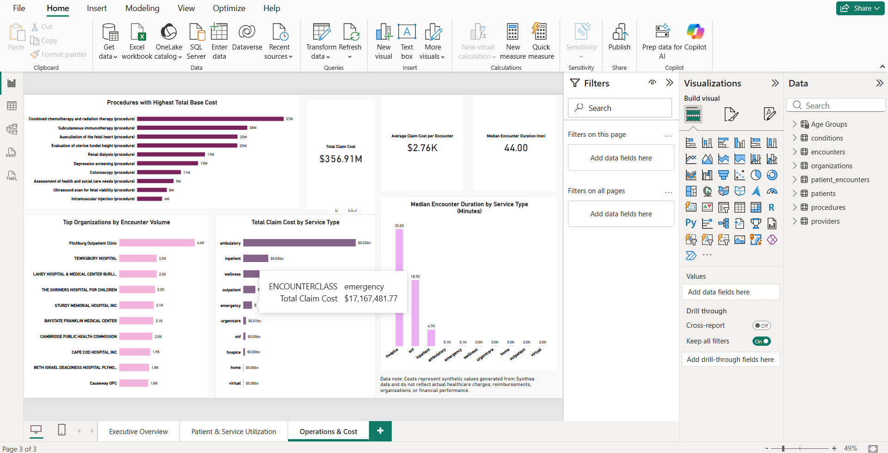

# Healthcare Operations & Patient Outcomes Intelligence

An end-to-end healthcare analytics project using **Python, SQL Server, Power BI, DAX, and Git/GitHub** to analyze **129,513 synthetic healthcare encounters across 2,274 patients**.

The project examines patient demand, service utilization, operational workload, encounter patterns, procedures, patient demographics, and synthetic healthcare costs to demonstrate how healthcare data can support operational and resource-planning decisions.

> **Data Disclaimer:** This project uses synthetic healthcare data generated with Synthea. It does not contain real patient, provider, hospital, or financial data.

## Business Problem

Hospital management requires a consolidated view of patient demand, service utilization, patient patterns, operational workload, and healthcare costs to support informed capacity and resource-planning decisions.

This project develops an end-to-end analytics solution that transforms raw synthetic healthcare data into structured analytical datasets, SQL-based insights, and an interactive Power BI dashboard.

## Project Overview

Healthcare organizations generate large volumes of clinical and operational data. Transforming these records into useful information requires data cleaning, relational modelling, statistical analysis, database querying, and effective visualization.

This project develops an end-to-end analytics workflow for examining patient demand, healthcare service utilization, procedure activity, encounter duration, and operational cost patterns.

The analysis uses healthcare data generated with Synthea. The dataset is entirely synthetic and does not contain real patient records.

## Business Problem

Hospital management needs a data-driven view of patient demand, healthcare service utilization, patient characteristics, and operational workload to support resource allocation and capacity-planning decisions.

The project investigates questions including:

- How does healthcare utilization vary over time?
- Which encounter types account for the greatest service volume?
- How does utilization differ across patient age groups?
- Which procedures and recorded conditions/findings occur most frequently?
- How do encounter duration and healthcare costs differ across service types?
- Where are high-utilization patterns concentrated?

## Technology Stack

- **Python** — data cleaning, transformation, validation, statistical analysis and visualization
- **Pandas** — data manipulation and feature engineering
- **Matplotlib** — exploratory data visualization
- **Microsoft SQL Server** — relational data storage and analytical querying
- **SQL** — joins, aggregations, segmentation, temporal analysis and cost analysis
- **Power BI** — data modelling, DAX measures and interactive dashboards
- **Git/GitHub** — version control and project documentation

## Dataset

The project uses synthetic healthcare data generated with Synthea.

The analytical dataset contains:

| Dataset | Records |
|---|---:|
| Patients | 2,274 |
| Encounters | 129,513 |
| Conditions & Findings | 80,292 |
| Procedures | 354,079 |
| Providers | 961 |
| Organizations | 961 |

The encounter records span historical dates through September 22, 2026. Because 2026 represents a partial calendar year, completed-year trend analysis focuses on 2017–2025.

Large raw and processed CSV files are excluded from this repository.

## Data Preparation

Python was used to build a reproducible data-cleaning pipeline.

Key preparation steps included:

- parsing patient and encounter dates;
- validating unique patient and encounter identifiers;
- checking relationships between patients, encounters, conditions, procedures, providers and organizations;
- calculating encounter duration;
- calculating patient age at the time of each encounter;
- creating age-group categories;
- identifying missing values without automatically treating structurally missing fields as errors;
- checking for duplicate records and negative procedure durations;
- removing unnecessary synthetic identifiers from analytical datasets.

All 129,513 encounter records successfully matched a patient, and all condition and procedure records matched valid patient and encounter identifiers.

## Relational Data Model

The processed data was loaded into Microsoft SQL Server using Python, SQLAlchemy and pyodbc.

The analytical model connects:

- patients to encounters;
- encounters to conditions;
- encounters to procedures;
- encounters to providers;
- providers to organizations.

The generated dataset contained 961 providers associated with 961 distinct organizations.

## Exploratory Analysis

Python and SQL were used to investigate utilization patterns, encounter duration, patient characteristics, procedures, conditions/findings and synthetic costs.

### Selected Findings

- The dataset contains **2,274 patients and 129,513 encounters**.
- Ambulatory encounters account for the largest encounter volume, with **71,677 encounters**.
- Encounter activity was relatively stable from 2017–2025, with the highest annual volume occurring in **2021 (11,345 encounters)**.
- Wednesday recorded the largest overall encounter volume (**20,416 encounters**).
- Patients aged **45–59 generated the largest encounter volume (32,047)** and procedure volume (**89,031**) when age was calculated at the time of encounter.
- Depression screening was the most frequently recorded procedure (**35,745 procedures**).
- Renal dialysis occurred **20,503 times among 65 patients**, illustrating concentrated repeat utilization.
- Combined chemotherapy and radiation therapy produced the highest aggregate procedure base cost among the leading procedures, at approximately **37.0 million synthetic cost units**.
- Ambulatory care generated the largest aggregate claim cost because of its high encounter volume, while inpatient encounters had substantially higher average claim costs per encounter.
- Patient utilization was strongly right-skewed: mean encounters per patient were **56.95**, while the median was **36**.
- Encounter duration was also highly skewed for several service types, demonstrating why median duration provides important context alongside the mean.

These findings describe patterns in synthetic data and should not be interpreted as clinical or causal conclusions.

## Power BI Dashboard

The Power BI report contains three interactive pages:

### 1. Executive Overview
Provides high-level KPIs and trends including:

- total patients;
- total encounters;
- total procedures;
- total synthetic claim cost;
- median encounter duration;
- median encounters per patient;
- annual encounter trends;
- encounter volume by service type and day of week.



### 2. Patient & Service Utilization
Explores:

- procedure volume by age group;
- service utilization across age groups;
- frequently recorded conditions and findings;
- frequently performed procedures;
- age and gender filtering.



### 3. Operations & Cost
Examines:

- total synthetic claim cost;
- average claim cost per encounter;
- median encounter duration;
- organizations with high encounter volumes;
- claim cost by service type;
- procedures with high aggregate base costs.



### Operational Recommendations

Based on the patterns identified in this synthetic healthcare dataset, the following considerations could support operational decision-making in a comparable real-world healthcare setting:

- **Align capacity planning with service demand:** Ambulatory care accounted for the largest encounter volume (71,677 encounters). In a real healthcare environment, consistently high-volume services could be prioritized when reviewing staffing, appointment scheduling, and facility capacity.

- **Evaluate day-of-week demand patterns:** Wednesday recorded the highest encounter volume (20,416 encounters). Monitoring whether similar patterns persist over time could help healthcare organizations align staffing and scheduling with periods of higher service demand.

- **Monitor high-utilization patient groups:** The difference between the mean (56.95) and median (36) encounters per patient indicates a strongly right-skewed utilization pattern. Segmenting high-utilization patients could help organizations better understand repeated service use and support care-coordination planning.

- **Incorporate age-related utilization into resource planning:** Patients aged 45–59 generated the highest encounter (32,047) and procedure (89,031) volumes. Where similar patterns occur in real-world data, demographic utilization profiles could contribute to service-demand forecasting.

- **Account for recurring treatment workload:** Renal dialysis occurred 20,503 times among only 65 represented patients, demonstrating how recurring treatment pathways can generate substantial operational workload even when relatively few patients are involved.

- **Use median alongside mean service duration:** Highly skewed encounter durations show that averages alone may overstate the duration of a typical encounter. Including median duration in operational dashboards can provide a more representative view of typical service time.

- **Evaluate service volume and cost together:** Ambulatory care generated the largest aggregate claim cost because of its high volume, while inpatient encounters had substantially higher average costs per encounter. Monitoring both volume and unit-level cost can provide a more balanced view of operational and financial activity.

> **Note:** These recommendations are analytical interpretations of synthetic Synthea data and are intended to demonstrate how healthcare analytics can support operational decision-making. They are not clinical recommendations or conclusions about a real healthcare organization.

## Analytical Considerations

Several limitations were considered during analysis:

- Synthea generates synthetic records and does not represent actual healthcare organizations or populations.
- Missing values were interpreted according to field context rather than automatically imputed.
- The `conditions` dataset contains disorders, findings and situations; therefore, records were not treated exclusively as diagnosed diseases.
- 2026 is a partial year and was excluded from completed-year trend comparisons.
- High utilization or cost does not by itself establish staffing requirements, clinical severity or causality.
- Median statistics were used alongside means where distributions were strongly skewed.

## Repository Structure

```text
Healthcare-Operations-Analytics/
├── data/
│   ├── raw/
│   └── processed/
├── images/
├── powerbi/
│   └── Healthcare_Operations_Dashboard.pbix
├── python/
│   ├── 01_data_cleaning.py
│   ├── 02_load_to_sql_server.py
│   ├── 03_inspect_related_tables.py
│   ├── 04_clean_related_tables.py
│   ├── 05_load_related_to_sql.py
│   └── 06_python_eda.py
├── sql/
│   ├── 01_exploratory_analysis.sql
│   └── 02_relational_analysis.sql
├── .gitignore
├── README.md
└── requirements.txt